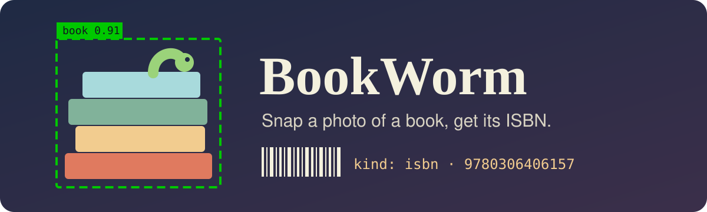
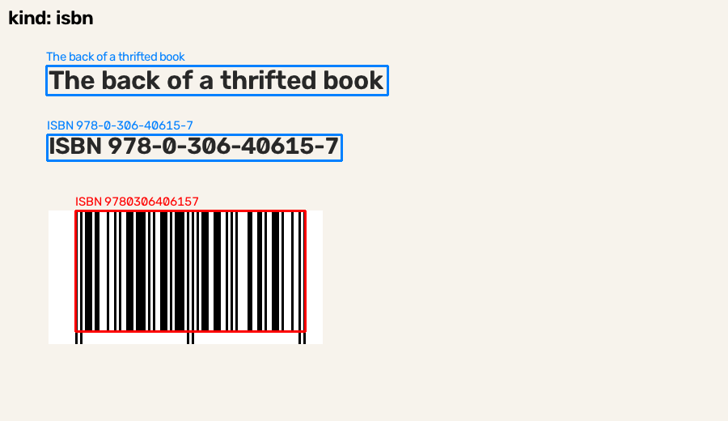

<p align="center">
  
</p>

<p align="center">
  
  
  <a href="https://github.com/astral-sh/uv"></a>
  <a href="https://docs.ultralytics.com/"></a>
  <a href="https://github.com/JaidedAI/EasyOCR"></a>
  <a href="https://github.com/zxing-cpp/zxing-cpp"></a>
  <a href="https://www.structlog.org/"></a>
  
</p>

<p align="center">
  <a href="#quick-start">Quick start</a> ·
  <a href="#how-a-scan-works">How a scan works</a> ·
  <a href="#logs">Logs</a> ·
  <a href="#tests">Tests</a> ·
  <a href="#roadmap">Roadmap</a>
</p>

# BookWorm

BookWorm looks at a photo of a book and tells you which one it is. Show it the back cover and it reads the ISBN from the barcode, or from the printed number when the barcode won't scan. Show it the front cover and it says it found a cover and gives you the text it could read.

It's for people who can't walk past a used bookstore. You're in a thrift shop with a paperback in your hand and you want to look it up before you buy it, and a photo should be enough for that.

> [!NOTE]
> Version 0.1.0 is a command-line scanner. Saving your finds to a local database and an agent that researches a book for you are next on the [roadmap](#roadmap).

<p align="center">
  
  <br>
  <sub>Output of <code>bookworm annotate</code> on a generated back cover. Red boxes are ISBN barcodes, blue boxes are text, green boxes are books.</sub>
</p>

## Quick start

You need Python 3.13 and [uv](https://github.com/astral-sh/uv).

```bash
git clone https://github.com/carlosValerio5/BookWorm.git
cd BookWorm
uv sync
```

Scan a photo. JPG and PNG work, and so do the HEIC files an iPhone saves.

```bash
uv run bookworm scan back-cover.heic
```

To get a copy of the photo with the boxes drawn on it:

```bash
uv run bookworm annotate back-cover.heic annotated.png
```

The first run is slow because it downloads the YOLO weights to `models/yolo26n.pt` and the EasyOCR models for Spanish and English. Once the models are loaded, the demo scan above took about 0.4 seconds.

Both commands print the result as JSON. `kind` is `isbn`, `cover` or `unknown`.

<details>
<summary>Full output for the demo image above</summary>

```json
{
  "scan_id": "588c79d3b8b54d628ab464b0d7c84f65",
  "image_path": "demo-back-cover.png",
  "kind": "isbn",
  "isbn": "9780306406157",
  "books": [],
  "barcodes": [
    {
      "isbn": "9780306406157",
      "box": { "x_min": 93, "y_min": 260, "x_max": 377, "y_max": 409 }
    }
  ],
  "texts": [
    {
      "text": "The back of a thrifted book",
      "confidence": 0.9258,
      "box": { "x_min": 57, "y_min": 81, "x_max": 479, "y_max": 117 }
    },
    {
      "text": "ISBN 978-0-306-40615-7",
      "confidence": 0.9871,
      "box": { "x_min": 58, "y_min": 166, "x_max": 422, "y_max": 198 }
    }
  ]
}
```

</details>

## How a scan works


Every photo goes through three readers:

| Reader | Library | What it does |
|---|---|---|
| Barcodes | zxing-cpp | Reads EAN-13 barcodes. A code only counts as an ISBN if it starts with 978 or 979 and its checksum is valid. |
| Books | Ultralytics YOLO26n | Finds the COCO `book` class with a confidence of 0.25 or more. |
| Text | EasyOCR | Reads Spanish and English and drops anything under 0.4 confidence. BookWorm then searches that text for a printed ISBN, even when OCR splits it over two lines. |

An ISBN from a barcode beats one found in the text. If there's no ISBN at all, a detected book makes the scan a `cover`, and anything else is `unknown`.

Stock YOLO has no barcode class, so barcodes go to zxing-cpp instead.

## Logs

Each step writes a JSON line to stderr and to `logs/bookworm.jsonl`. Here's one:

```json
{"call": "read_isbn_barcodes", "duration_ms": 30.09, "event": "call_finished", "scan_id": "37ef3305f38b4d73992dbd1144bd389e", "level": "info", "service": "bookworm.barcode_reading", "timestamp": "2026-09-15T06:51:09.555108Z"}
```

All the lines from one photo share a `scan_id`, so you can pull out a single scan:

```bash
jq 'select(.scan_id == "37ef3305f38b4d73992dbd1144bd389e")' logs/bookworm.jsonl
```

When a step fails, it logs the traceback with `call_failed` and then raises the error again. Logs from YOLO and EasyOCR come out as JSON too.

## Tests

```bash
uv run pytest -m "not slow"   # unit tests, no models loaded
uv run pytest -m slow         # loads YOLO and EasyOCR
uv run pytest --cov
```

You can also test against your own photos. Put them in `dataset/cover/`, `dataset/isbn/` or `dataset/unknown/`, and the slow tests check that each photo gets the kind of its folder. Name ISBN photos after their number (`dataset/isbn/9780306406157.heic`) and the test also checks that the scanner reads that number. `dataset/` is in `.gitignore`, so your photos stay on your machine.

## Labeling photos

`bookworm annotator` is a small local web app for building ground truth: the class, boxes and text you expect on a real photo.

```bash
uv run bookworm annotator dataset/
```

Open `http://127.0.0.1:8765`, pick a photo and pick its class first (`1` isbn, `2` cover, `3` unknown). Choose a box type (`b` book, `c` barcode, `i` printed_isbn, `t` title, `a` author, `p` publisher, `o` other_text), drag on the photo to draw a box, and type the text inside it. Drag a box to move it. `Delete` removes the selected box, `Ctrl/⌘ S` saves and `n` opens the next photo.

Each photo gets a JSON file in `labels/` that mirrors its path, like `labels/cover/IMG_0012.HEIC.json`. Boxes are stored in the original photo's pixels, the same coordinates the scanner reports. Saving is refused when a box falls outside the photo, a barcode isn't a valid ISBN, or a text box is empty. `labels/` is in `.gitignore`, like `dataset/`.

## Project layout

| Module | Job |
|---|---|
| `cli.py` | The `scan`, `annotate` and `annotator` commands (Typer) |
| `annotator/web_app.py` | The local labeling web app and its API (FastAPI) |
| `annotator/annotation_storage.py` | Lists photos, validates labels and saves them |
| `annotator/annotation_types.py` | The dataclasses that end up in a label file |
| `scan_classification.py` | Runs the three readers and picks the kind |
| `image_loading.py` | Opens JPG, PNG and HEIC files |
| `barcode_reading.py` | EAN-13 barcodes to ISBNs |
| `book_detection.py` | YOLO book boxes |
| `text_recognition.py` | EasyOCR text with the confidence filter |
| `isbn_validation.py` | ISBN-10 and ISBN-13 checksums, ISBN search in free text |
| `annotation_drawing.py` | Draws the boxes and the `kind` label |
| `logging_setup.py` | structlog JSON config and the `log_call` timer |
| `scan_types.py` | The dataclasses that end up in the JSON |

## Known limits

A cover that fills the whole frame may not be detected as a book, and then the scan comes back `unknown`.

A `cover` result gives you the text on the cover. It doesn't tell you the title or author yet.

## Roadmap

- [x] Tell a cover from an ISBN and read the ISBN
- [x] HEIC photos and Spanish text
- [ ] Save finds to a local database
- [ ] An agent that uses tool calls to research a book for you

## Releasing

Versions follow [SemVer](https://semver.org), and a release tag is always `vMAJOR.MINOR.PATCH`. Tags like `0.2.0`, `v0.2` or `v0.2.0-rc.1` are rejected. Every release is listed in [CHANGELOG.md](CHANGELOG.md).

1. Bump the version with `uv version --bump minor` (or `patch`, `major`).
2. In `CHANGELOG.md`, move the entries under `[Unreleased]` into a new `## [X.Y.Z] - YYYY-MM-DD` section and update the compare links at the bottom.
3. Run `uv run pytest -m "not slow"`. It fails if the changelog has no section for the new version.
4. Merge to `main`, then check, tag and push from the merge commit:

```bash
uv run python scripts/check_release_tag.py vX.Y.Z
git tag -a vX.Y.Z -m "vX.Y.Z"
git push origin vX.Y.Z
```

The `Release tag` workflow runs the same check on every tag pushed to GitHub and fails when the tag, `pyproject.toml` and the changelog disagree.

## Contributing

The code conventions and the list of mistakes we've already made are in [CLAUDE.md](CLAUDE.md). Read it before opening a PR.
