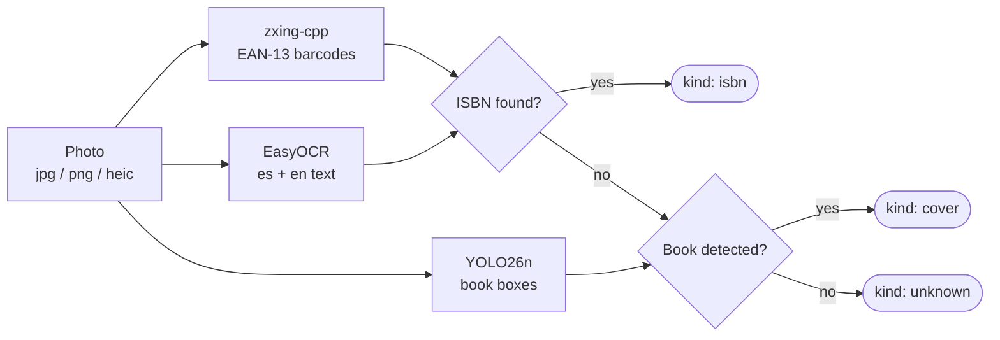
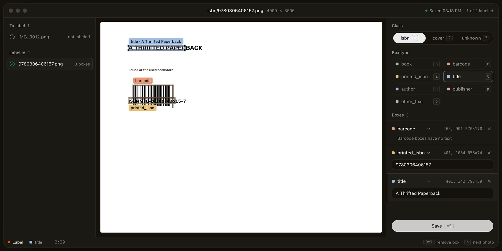

<p align="center">
  
</p>

<p align="center">
  
  
  <a href="https://github.com/astral-sh/uv"></a>
  <a href="https://docs.ultralytics.com/"></a>
  <a href="https://github.com/JaidedAI/EasyOCR"></a>
  <a href="https://github.com/zxing-cpp/zxing-cpp"></a>
  <a href="https://www.structlog.org/"></a>
  <a href="https://expo.dev/"></a>
  
</p>

<p align="center">
  <a href="#quick-start">Quick start</a> ·
  <a href="#how-a-scan-works">How a scan works</a> ·
  <a href="#building-a-training-dataset">Training</a> ·
  <a href="#collecting-candidate-photos">Crawler</a> ·
  <a href="#mobile-app">Mobile app</a> ·
  <a href="#logs">Logs</a> ·
  <a href="#tests">Tests</a> ·
  <a href="#roadmap">Roadmap</a>
</p>

# BookWorm

BookWorm looks at a photo of a book and tells you which one it is. Show it the back cover and it reads the ISBN from the barcode, or from the printed number when the barcode won't scan. Show it the front cover and it says it found a cover and gives you the text it could read.

It's for people who can't walk past a used bookstore. You're in a thrift shop with a paperback in your hand and you want to look it up before you buy it, and a photo should be enough for that.

> [!NOTE]
> Version 0.2.0 scans with a book detector fine-tuned on our own labeled photos, comes with the tools to label and train that detector yourself, and has a mobile app that shows a live box around a book while you aim. Saving your finds to a local database and an agent that researches a book for you are next on the [roadmap](#roadmap).

<p align="center">
  
  <br>
  <sub>Output of <code>bookworm annotate</code> on a generated back cover. Red boxes are ISBN barcodes, blue boxes are text, green boxes are books.</sub>
</p>

## Quick start

You need Python 3.13 and [uv](https://github.com/astral-sh/uv).

```bash
git clone https://github.com/carlosValerio5/BookWorm.git
cd BookWorm
uv sync
```

Scan a photo. JPG and PNG work, and so do the HEIC files an iPhone saves.

```bash
uv run bookworm scan back-cover.heic
```

To get a copy of the photo with the boxes drawn on it:

```bash
uv run bookworm annotate back-cover.heic annotated.png
```

The first run is slow because it downloads the YOLO weights to `models/yolo26n.pt` and the EasyOCR models for Spanish and English. Once the models are loaded, the demo scan above took about 0.4 seconds.

Both commands print the result as JSON. `kind` is `isbn`, `cover` or `unknown`.

<details>
<summary>Full output for the demo image above</summary>

```json
{
  "scan_id": "588c79d3b8b54d628ab464b0d7c84f65",
  "image_path": "demo-back-cover.png",
  "kind": "isbn",
  "isbn": "9780306406157",
  "books": [],
  "barcodes": [
    {
      "isbn": "9780306406157",
      "box": { "x_min": 93, "y_min": 260, "x_max": 377, "y_max": 409 }
    }
  ],
  "texts": [
    {
      "text": "The back of a thrifted book",
      "confidence": 0.9258,
      "box": { "x_min": 57, "y_min": 81, "x_max": 479, "y_max": 117 }
    },
    {
      "text": "ISBN 978-0-306-40615-7",
      "confidence": 0.9871,
      "box": { "x_min": 58, "y_min": 166, "x_max": 422, "y_max": 198 }
    }
  ]
}
```

</details>

## How a scan works



Every photo goes through three readers:

| Reader | Library | What it does |
|---|---|---|
| Barcodes | zxing-cpp | Reads EAN-13 barcodes. A code only counts as an ISBN if it starts with 978 or 979 and its checksum is valid. |
| Books | Ultralytics YOLO26n | Finds the COCO `book` class with a confidence of 0.25 or more. |
| Text | EasyOCR | Reads Spanish and English and drops anything under 0.4 confidence. BookWorm then searches that text for a printed ISBN, even when OCR splits it over two lines. |

An ISBN from a barcode beats one found in the text. If there's no ISBN at all, a detected book makes the scan a `cover`, and anything else is `unknown`.

Stock YOLO has no barcode class, so barcodes go to zxing-cpp instead.

## Logs

Each step logs an event. The terminal shows it as a readable line (colored when it's a real terminal), and `logs/bookworm.jsonl` gets the same event as JSON. Here's one from the file:

```json
{"call": "read_isbn_barcodes", "duration_ms": 30.09, "event": "call_finished", "scan_id": "37ef3305f38b4d73992dbd1144bd389e", "level": "info", "service": "bookworm.barcode_reading", "timestamp": "2026-09-15T06:51:09.555108Z"}
```

All the lines from one photo share a `scan_id`, so you can pull out a single scan:

```bash
jq 'select(.scan_id == "37ef3305f38b4d73992dbd1144bd389e")' logs/bookworm.jsonl
```

When a step fails, it logs the traceback with `call_failed` and then raises the error again. Logs from YOLO and EasyOCR come out as JSON too.

## Tests

```bash
uv run pytest -m "not slow"   # unit tests, no models loaded
uv run pytest -m slow         # loads YOLO and EasyOCR
uv run pytest --cov
```

You can also test against your own photos. Put them in `dataset/cover/`, `dataset/isbn/` or `dataset/unknown/`, and the slow tests check that each photo gets the kind of its folder. Name ISBN photos after their number (`dataset/isbn/9780306406157.heic`) and the test also checks that the scanner reads that number. `dataset/` is in `.gitignore`, so your photos stay on your machine.

## Labeling photos

`bookworm annotator` is a small local web app for building ground truth: the class, boxes and text you expect on a real photo.

```bash
uv run bookworm annotator dataset/
```

Open `http://127.0.0.1:8765`, pick a photo and pick its class first (`1` isbn, `2` cover, `3` unknown). Choose a box type (`b` book, `c` barcode, `i` printed_isbn, `t` title, `a` author, `p` publisher, `o` other_text), drag on the photo to draw a box, and type the text inside it. Barcode boxes have no text; the number goes in a `printed_isbn` box. Drag a box to move it. `Delete` removes the selected box, `Ctrl/⌘ S` saves and `n` opens the next photo.

The annotator has two edit modes, like vim: **Normal** (the default) selects, moves and resizes boxes; **Insert** always starts a new box on drag, even on top of an existing one, so you can nest boxes (a `title` box inside a `book` box, for example). `Tab` toggles between them and `Escape` always cancels back to Normal, canceling any box you're mid-way through drawing.

The "Detect boxes" button runs the same detection the scanner uses (YOLO for `book` covers, barcode reading for `barcode`, and OCR for text) on the open photo. Text that reads as a valid ISBN becomes a `printed_isbn` box; every other recognized text region becomes an `other_text` box with its text already filled in. All of these render dashed until you've reviewed them. `title`, `author` and `publisher` still aren't detected automatically — OCR doesn't know which field is which — so switch an `other_text` box's type by hand once you know what it is.

<p align="center">
  
  <br>
  <sub>A back cover mid-label: <code>barcode</code> over the EAN-13, <code>printed_isbn</code> and <code>title</code> boxes with their text, saved and ready for the next photo.</sub>
</p>

Each photo gets a JSON file in `labels/` that mirrors its path, like `labels/cover/IMG_0012.HEIC.json`. Boxes are stored in the original photo's pixels, the same coordinates the scanner reports. Saving is refused when a box falls outside the photo, a `printed_isbn` has no valid ISBN, or a text box is empty. `labels/` is in `.gitignore`, like `dataset/`.

## Building a training dataset

Fine-tuning the book detector needs labeled photos. Get photos into a folder from your own camera roll, or pull them from a public ("anyone with the link") Google Drive folder:

```bash
uv run bookworm fetch-drive https://drive.google.com/drive/folders/your-folder-id
```

Downloads every photo into `dataset/drive/` (or `--output-dir`). Rerunning skips files already downloaded. Two different photos that happen to share a filename (two phones both saving `IMG_0034.HEIC`, for example) don't collide: whichever name isn't unique gets its Drive file ID prefixed.

Label the photos with `bookworm annotator` (above), then turn the labels into a YOLO dataset:

```bash
uv run bookworm build-yolo-dataset dataset/
```

Writes `dataset/yolo/` (`images/{train,val}`, `labels/{train,val}`, `data.yaml`) with the annotator's 7 box classes (`book`, `barcode`, `printed_isbn`, `title`, `author`, `publisher`, `other_text`) as YOLO classes 0-6. The train/val split is deterministic per photo, so labeling more photos later doesn't reshuffle photos already placed, and photos with no label are skipped instead of failing the build.

## Training the detector

```bash
uv run bookworm train-yolo dataset/yolo/data.yaml
```

Fine-tunes `models/yolo26n.pt` on the dataset and prints the path to the best checkpoint. `--epochs`, `--imgsz` and `--batch` (default 4) override ultralytics' own defaults.

```bash
uv run bookworm dashboard
```

Opens `http://127.0.0.1:8766` on a list of every run under `runs/`. Pick one to see its loss (train vs val, live from `results.csv`) and validation accuracy (precision, recall, mAP50, mAP50-95), plus the run's hyperparameters and a dashed reference line for the un-fine-tuned base weights.

`bookworm scan`, `annotate` and `annotator` already detect books with `models/book_detector.pt`, fine-tuned this way on our own 7-class dataset, instead of the base COCO weights.

## Collecting candidate photos

```bash
uv run bookworm-crawl run blog_pages --seed-file crawler_seeds/blog_pages.toml --contact you@example.com
```

Crawls one source (`blog_pages`, `commons_categories`) for candidate training photos, saving each with a hint label (`cover`, `isbn` or `spine`). A run picks up where the last one stopped, obeys the source's `robots.txt`, waits between requests to the same host, and stops on a 429. State lives in `dataset/crawled/crawl_state.sqlite3`.

```bash
uv run bookworm-crawl status
```

Prints request counts per source and saved photo counts per hint label.

## Mobile app

```bash
uv run bookworm serve
```

Opens the BookWorm Mobile API at `http://0.0.0.0:8000` for the Expo app in [`bookworm-mobile/`](bookworm-mobile/) to scan against. While you're aiming the camera, the app shows a live gold box over a detected book — the `WS /api/live-detect` endpoint runs book detection only, a few times a second, on downscaled snapshots. Tapping still runs the full `scan_image` pipeline (YOLO, OCR, zxing) and the result sheet and biblioteca show what was actually read (ISBN, OCR snippets), not a placeholder title and author.

## Project layout

| Module | Job |
|---|---|
| `cli.py` | The `scan`, `annotate`, `annotator`, `dashboard`, `serve`, `fetch-drive`, `build-yolo-dataset` and `train-yolo` commands (Typer) |
| `annotator/web_app.py` | The local labeling web app and its API (FastAPI) |
| `annotator/annotation_storage.py` | Lists photos, validates labels and saves them |
| `annotator/annotation_types.py` | The dataclasses that end up in a label file |
| `scan_classification.py` | Runs the three readers and picks the kind |
| `image_loading.py` | Opens JPG, PNG and HEIC files |
| `barcode_reading.py` | EAN-13 barcodes to ISBNs |
| `book_detection.py` | YOLO book boxes |
| `text_recognition.py` | EasyOCR text with the confidence filter |
| `isbn_validation.py` | ISBN-10 and ISBN-13 checksums, ISBN search in free text |
| `annotation_drawing.py` | Draws the boxes and the `kind` label |
| `logging_setup.py` | structlog JSON config and the `log_call` timer |
| `scan_types.py` | The dataclasses that end up in the JSON |
| `drive_download.py` | Downloads photos from a public Google Drive folder |
| `yolo_dataset.py` | Converts annotator labels into a YOLO training dataset |
| `yolo_training.py` | Fine-tunes the book detector |
| `training_dashboard/` | `bookworm dashboard`'s metrics reading and web app |
| `mobile/server.py` | The mobile API: `POST /api/scan` and the `WS /api/live-detect` websocket |
| `crawler/` | `bookworm-crawl`'s sources, robots.txt policy, request pacing and crawl state |

## Known limits

A cover that fills the whole frame may not be detected as a book, and then the scan comes back `unknown`.

A `cover` result gives you the text on the cover. It doesn't tell you the title or author yet.

## Roadmap

- [x] Tell a cover from an ISBN and read the ISBN
- [x] HEIC photos and Spanish text
- [x] Label, train and fine-tune a custom book detector
- [x] Mobile app with live detection while aiming the camera
- [ ] Save finds to a local database
- [ ] An agent that uses tool calls to research a book for you

## Releasing

Versions follow [SemVer](https://semver.org), and a release tag is always `vMAJOR.MINOR.PATCH`. Tags like `0.2.0`, `v0.2` or `v0.2.0-rc.1` are rejected. Every release is listed in [CHANGELOG.md](CHANGELOG.md).

1. Bump the version with `uv version --bump minor` (or `patch`, `major`).
2. In `CHANGELOG.md`, move the entries under `[Unreleased]` into a new `## [X.Y.Z] - YYYY-MM-DD` section and update the compare links at the bottom.
3. Run `uv run pytest -m "not slow"`. It fails if the changelog has no section for the new version.
4. Merge to `main`, then check, tag and push from the merge commit:

```bash
uv run python scripts/check_release_tag.py vX.Y.Z
git tag -a vX.Y.Z -m "vX.Y.Z"
git push origin vX.Y.Z
```

The `Release tag` workflow runs the same check on every tag pushed to GitHub and fails when the tag, `pyproject.toml` and the changelog disagree.

## Contributing

The code conventions and the list of mistakes we've already made are in [CLAUDE.md](CLAUDE.md). Read it before opening a PR.
